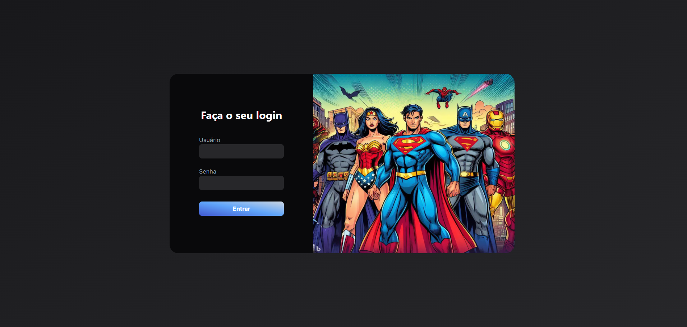
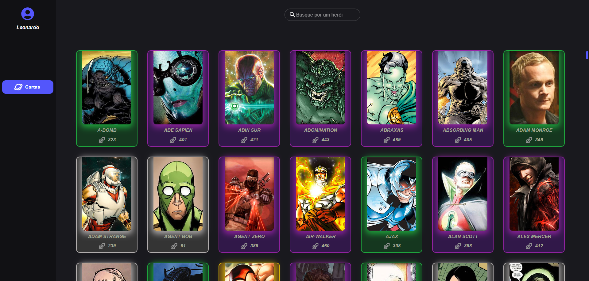
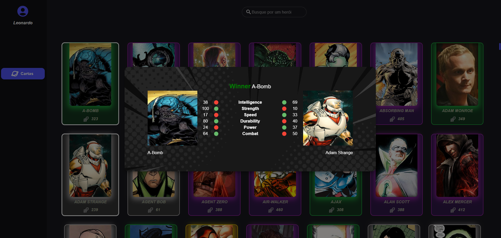

# Desafio Azapfy

# 🎯Objetivo:

Desenvolver o front-end de uma aplicação web que abrace a temática de heróis e criar minigame com sistema de batalha entre os heróis, a partir do consumo da API <link>https://homologacao3.azapfy.com.br/api/ps/metahumans</link>.

## 🔧 Foi desenvolvido:

- Formulário de login
- Listagem de heróis
- Filtro de heróis
- Sistema de combate
  
# 🖥️Tecnologias utilizadas:

- Typescript 
- NextJS 
- React 
- MUI 
- TailwindCSS 

# 🛠️ Como Utilizar:

1. Clone o repositório para sua máquina utilizando o comando:
  
	`git clone git@github.com:athena272/desafio-frontend-guilherme.git`

2. Abra um terminal na **pasta raiz do repositório** e execute o comando <code>npm run dev</code>

3. Após isso, você poderá acessar o frontend da aplicação localmente através do localhost na porta 3000, no link: <link>http://localhost:3000</link>.

4. A tela de login pedirá um usuário e senha, pode usar qualquer um a seu gosto. No exemplo da foto usei, athena272 e para senha 123

# Deploy

<link>https://desafio-frontend-guilherme.vercel.app/</link> (Há que permitir o conteúdo inseguro nas configurações do navegador para visualizar todo o conteúdo do site)

## 📷 Preview:

#### Início

#### Dashboard

